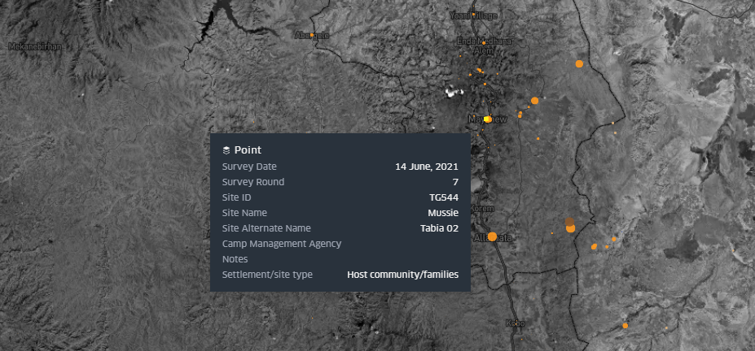

# Data Literacy
```{warning}
This chapter is in draft stage.
```

The purpose of this chapter is to introduce the reader to the concept of data, what it is, how it used in humanitarian response and its relevance in the role of information management. This chapter forms an important basis for subsequent chapters as it aims to clearly describe key concepts around data to ensure their clear and shared understanding. This shared vocabulary is vital for the collaboration needed at the various stages of the data's lifecycle. This chapter is primarily aimed at IM's but is also relevant to any humanitarian involved to any degree in evidence-based decision making.[^footnote1]  

```{figure} ./images/idontthinkitmeanswhatyouthinkitmeans.jpg
---
width: 500px
name: means
---
A shared understanding of terms is important for engagement around data
```
## What is data?
Data is the physical representation of information in a manner suitable for communication, interpretation, or processing by human beings or by automatic means.[^footnote2] It can be structured or unstructured, can come in many different forms (human-readable or machine-readable) and can come from any number of sources, using any number of methods. While the terms *data*, *information* and *knowledge* are quite often used interchangeably it is helpful to think of information as data integrated into context, and knowledge as a collection of information, processed in a way that provides learning.

## What does it look like?
Data is all around us but is usually messy and unstructured. Processing this information into a structure that can provide sense is at the core of IM. This 'sense-making' can use different approaches - an experienced camp manager may decide to walk into a new camp, walk around it observing it, deciding on what actions they need to prioritize. Another may prefer to set up a list of indicators to measure specific needs in the camp. The approaches are different (and quite often complimentary) but the goal and process are to a large extent the same.  

```{admonition} Exercise
Take a look at your desk and choose an object. Describe the attributes of that item. Perhaps you can describe the items colour, its length, its width, its texture, the materials its constructed from or how effective it is for your work. A surprising amount of data can be gathered from even the simplest of objects.
```

To get from messy data to structured that that can be used - by itself, or more commonly in conjunction with other datasets - a degree of organizing, tagging or categorizing must take place. If a survey is used, those categories are determined by the questions asked the type of questions and the response options. When setting these categories it is very important that each person involved with the data - from the person giving the response, the enumerator right up to those whose programmatic decisions it informs - has a clear and common understanding of what and how a concept is captured in these categories. 

### Formats
Valuable humanitarian data can often start out as paper survey responses, hand written notes (ie. distribution details) or as handwritten notes (such as from Focus Group Discussions). To aid the cleaning, processing and management of this data, digitization may be required. Digital data can be stored in a number of the following formats and is closely linked to the tools used to gather and/or store the data:
* **Tabular data:** By far the most common format for humanitarian data, Excel or Comma Separated Value (CSV) files show data as a table where each column represent as variable in your data and each row ideally represents an observation. [^footnote3]  
* **Relational databases:** Data cant always be represented in a single table. Quite often there is a need to present the data across multiple tables, showing the linkages(relationships) between variables in different table. Relational databases provide an underlying data model for most modern websites and software. An example use for a relational database could be in the recording of trainings, where one table contains rows, each representing a single training while a second table contains the list of participants. The relationships between these two tables could be defined as *each training can contain multiple participants* and *each participant can attend multiple trainings*  
* **APIs** To aid the access and transfer of data, it is very common for modern software systems to have an API, in which other websites (or data analysis tools) can request data from the underlying data store. The most common file format for these is called JSON, a semi-human readable format with the advantage over tabular formats in that is can represent messy semi-structured data or complex relationships that would otherwise require a database. [^footnote4]
* **Spatial:** Spatial data formats such as .shp, .gpg, .geojson .geotiff or .dem are used to store 2d or 3d spatial data. Most of these formats can display or export to tabular formats.

```{figure} ./images/formats.png
---
width: 800px
name: formats
---
Examples of data as tables, a relational database, and as JSON from an travel distance API
```

### Sources
* Common Operating Datasets (CODs)
* HDX
* Internal systems
* Others
* Non traditional sources

## Data concepts
.
### Values
Simple data values can be numeric; such as an integer (whole number) or float; boolean, such as a yes/no or true/false; or a string, a sequence of symbols such as a text answer. Compound values are combinations of simple values. Examples include dates, time, or list of values (such as a list of answers to a multiple choice question) [^footnote7]  

### Types of data
Variables (items of data) can spilt into two groups, quantitative (numeric) or categoric (no inherent order). Quantitative variables can either be discrete, meaning they have a finite number of values (eg household size) or continuous, meaning an infinite number of values are possible (eg. a persons height or distance to a health facility)

### Scales
Data can be classified under the following 4 scales of measurement:
- **Nominal scales**: Nominal values/variables, sometimes called *categorical values* don't have a numeric value so cannot be added, subtracted or multiplied. They do not have an order. For example, the name of a district that an IDP is from.
- **Ordinal scale**: Contains values that can be put in order. For example, the levels of satisfaction with a training.
- **Interval scale**:  Contains ordinal numbers with meaningful divisions. For example, temperature or time.
- **Ratio scale**: Ratio scales have all of the characteristics of interval scales as well as a true zero. For example, a persons height.

```{figure} ./images/typesofdata.png
---
width: 800px
name: formats
---
Types of data and how they relate
```


### Goal/Strategic Objective
A specific end result desired or expected to occur as a consequence, at least in part, of an intervention or  activity. It is the higher order objective that will assure national capacity building to which a development intervention is intended to contribute.

### Impact
Impact implies changes in people’s lives. This might include changes in knowledge, skill, behaviour, health or living conditions for children, adults, families or communities. Such changes are positive or negative longterm effects on identifiable population groups produced by a development intervention, directly or indirectly, intended or unintended.

### Outcome
Outcomes represent changes in the institutional and behavioral capacities for development conditions that occur between the completion of outputs and the achievement of goals.

### Outputs
Outputs are changes in skills or abilities and capacities of individuals or institutions, or the availability of new products and services that result from the completion of activities within a development intervention within the control of the organization. They are achieved with the resources provided and within the time period specified.

### Activities
Actions taken or work performed through which inputs, such as funds, technical assistance and other types of resources, are mobilized to produce specific outputs.

### Inputs 
The financial, human, material, technological and information resources used for development interventions.

### Indicators
Usually separated into two categories:
- Need indicators: a quantitative or qualitative unit of measurement of need which when monitored periodically can be used as a measure of impact.
- Response/performance indicators: used to measure outputs or outcomes.

### Target
Specifies a particular value that an indicator should reach by to meet agreed standard of service or programme goals. Setting target values for most indicators requires a level of contextualization and can be influences by external factors such as resources available.

### Standard
...

### Benchmark
Reference point or standard, including norms, against which progress or achievements can be assessed. A benchmark refers to the performance that has been achieved in the recent past by other comparable organizations, or what can be reasonably expected to have been achieved in similar circumstances.

### Primary data vs secondary data
...
---
## Information Management tips 
The following tips are a collection of commonly encountered issues in humanitarian IM and how to avoid them. The tips are a shortened from their usual form to avoid overlap with other chapters where many of the issues are expanded in more detail.[^footnote5]

### 1. Use Excel for numerical data
```{figure} ./images/paintingwithexcel.jpg
---
width: 500px
name: formats
---
Tatsuo Horiuchi uses Excel to paint beautiful Japanese lanscapes. Don't follow Tatsuo
```
Don't use software such as Word for gathering and analysing numerical data. Likewise, be careful not to use Excel to over visualise how your data is represented. Simple, well structured data is best for analysis and sharing with others.  

### 2. Save often, use versioning, and name files sensibly
```{figure} ./images/saveoften.png
---
width: 500px
name: formats
---
Click 
You don't want to work all day on an analysis to suddenly find that the fil crashed before you had a chance to save it. In Excel, there is an option to have your files autosave at a specified interval.  

If saving to OneDrive or Sharepoint, you will see a small downward arrow which allows youto view the file's *Version History*. to view or roll back to previous version of a document. Alternatively you can save multiple versions of the file following certain milestones or use a software versioning software such as Git.  

Try have you and your team use a consistent, welll understood naming convention for files. The format I use is as follows:  *[year][month(2digists)][date]-[initials]-[version]*. For example 20182307-IMtips-BMD-v1.xlsx
*File* > *Options* to get Excel to save more regularly
```
### 3. Backup your data  
What if your computer crashes or is stolen?  
What if you need to collaborate on a file?  
Make use of Onedrive/Sharepoint. Onedrive is ideal for working documents (you can right-click on a file and share it collaboratively). 

### 4. Check for existing data, communicate  
Networking and communication are important but sometimes overlooked skills for IM. It's important to know what other agencies and clusters are planning in terms of data collection and what challenges they are facing that may be better addressed with a collective approach. Checking for pre-existing data or planning assessments can help avoid duplication of efforts and unnecessarily *reinventing the wheel*.

### 5. Use mobile data collection
The use of mobile data collection tools such as [Kobo Toolbox](https://kobo.humanitarianresponse.info/) support faster and more robust data collection. By enforcing checks on data inputs it reduces input errors, while also removing time consuming and error-prone tasks of manual data entry of paper forms.

While ideal for surveys/assessments, be careful not to over-fit such tools into scenarios that require *case management* type functionality. 

### 6. Consistent variable naming
*Are we talking about the same thing?* The terms/concepts describe in your surveys and data - does everyone have a clear and shared understanding of what they mean? Are you reusing well known and tested terms or are you inventing new ones. [^footnote6]

### 7. Understand meta-data
  
...and why it is important. Meta-data is data that described data. For example, your survey data files should contain information describing where the data was collected, on which dates, the methodology used and relevant focal point. Including metadata in your datasets is an important habit for IMs, as it encourages reuse of the data and signifies a robust approach to analysis.

### 8. Spreadsheets - only one piece of information per cell
  
Storing multiple points of data in a single cell makes many types of analysis very difficult. Where possible try to expand these values onto their own rows (sometimes called "exploding" or "melting".)

### 9. Record data at a granular level and aggregate up  
When you have data at a low unit of measurement, for example, the number of people using a specific Complaints and Feedback (CFM) desk, it is straightforward to aggregate that data to a higher unit, for example, the number of people using CFMs in a district. However, be careful of receiving data already aggregated as it is usually not possible to disaggregate it into its component parts. If your analysis depends on having data at a certain unit-level, make sure to have it collected or sent to you in at least the same or lower level of disaggregation. Aggregation may hide or disregard useful data useful for your analysis or quality control.

### 10. Learn pivot tables  

Pivot tables are a powerful tool for aggregating data in Excel. (also called "groupby" in other software)

### 11. Learn VLOOKUP and Index Match  


### 12. Don't merge cells in a spreadsheet  
  
Don't merge cells in a spreadsheet. Tables should contain an equal number of rows and columns. Merging cells breaks pivoting and filtering and goes against rule number 1 (when done for reasons of aesthetics). 

### 13. Keep data types and names consistent in columns
  
Make sure that the spelling (including case) and format of values remain consistent for all values in a column. 

### 14. Keep all similar data in one sheet
  
Resist the temptation to split large datasets across tabs, using a tab for each region etc. This makes analysis and consolidated storage and management of the data harder. Instead add a column to capture the category names.

### 15. Check data relationships


### 16. Get coordinates for point data
  
If you have data that represents a point such as a hospital or a camp, instead of just naming it or giving its address you could also collect coordinates for it. There are many possible ways of doing this:
- Using any app on your phone that records GPS
- In a mobile data collection tool such as Kobo Toolbox
- Using a geocoder, which outputs coordinates for given addresses or locations. [Nominatim](http://nominatim.openstreetmap.org/) is a free service using Open Street Map data.
- The low tech approach of drawing on paper maps, digitizing later. [Fieldpapers](is a good tool for this)


[^footnote1]: Much of this chapter is adapted from [School of Data](https://schoolofdata.org/courses/) and IFRC's [Data Playbook](https://preparecenter.org/toolkit/data-playbook-toolkit/)
[^footnote2]: From the UNECE [Terminology on Statistical Metadata](https://unece.org/info/Statistics/pub/21878)
[^footnote3]: This form of data presentation is called [Tidy Data](https://vita.had.co.nz/papers/tidy-data.pdf) and is considered as an optimal form of representing data to enable data cleaning and analysis.
[^footnote4]: A simple example o this is to search by a category on [Reliefweb](https://reliefweb.int/updates) and clicking "API at the bottom of the page. This link can then be used by Excel which can show the data fields as a table.
[^footnote5]: Adapted from the excellent work of [Simon B Johnson](https://simonbjohnson.github.io/im-tips)
[^footnote6]: OCHA's [vocabulary page](http://vocabulary.unocha.org/) is a good starting point for naming conventions.
[^footnote7]: Harvards [CS109A](https://harvard-iacs.github.io/2019-CS109A/lectures/lecture2/) has a number of useful reading materials and exercises on the topic of data
